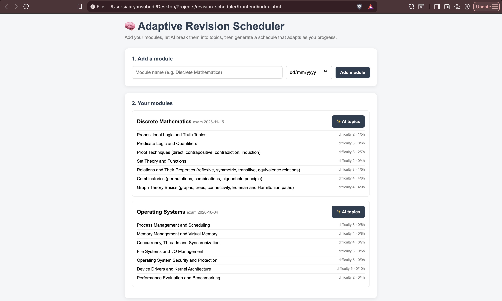
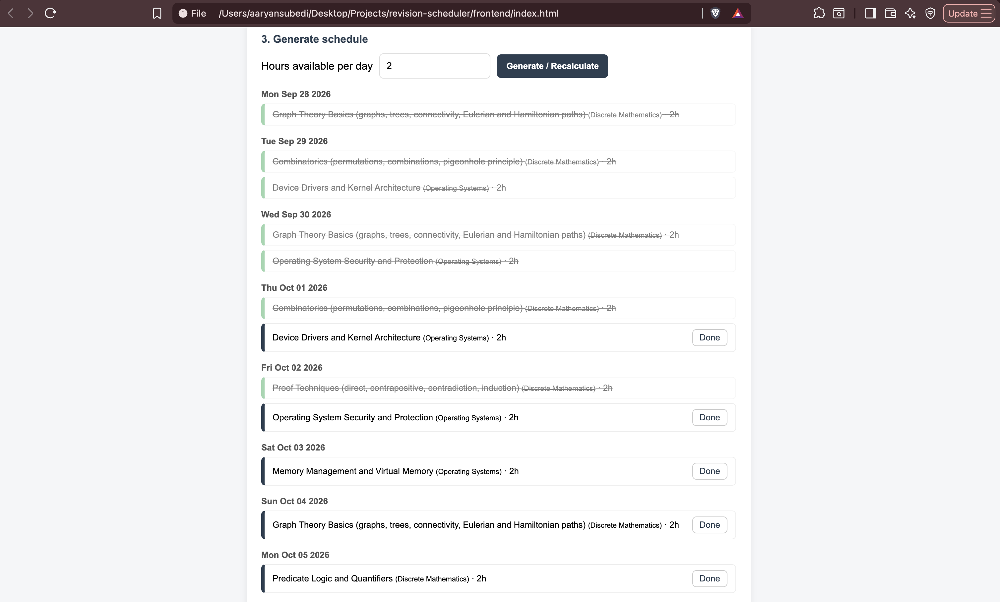

# 🧠 Adaptive Revision Scheduler

A full-stack app that builds a revision timetable from your modules and exam dates, then re-plans it as you make progress.

## Why I built this

I wanted to explore how a scheduling problem could be solved with a heuristic algorithm, rather than just wrapping an LLM around the whole task. The main challenge was designing the scheduling logic so that completing work actually changes future allocations, instead of generating one static timetable and leaving it to go stale.

## Features
- Add modules with exam dates
- AI (Groq) breaks each module into topics with difficulty and estimated hours
- A custom greedy algorithm allocates your daily study hours across topics, prioritizing by urgency and difficulty
- Mark sessions as done — the schedule recalculates and re-plans remaining work
- Persistent storage via H2 (file-based)

**AI vs. algorithm — who does what:**
- **AI (Groq):** structured topic decomposition only — turning "Discrete Mathematics" into a list of specific sub-topics with estimated difficulty and hours
- **Scheduling:** a custom greedy algorithm I designed — the AI has no involvement in deciding what gets studied when

## The algorithm

Each day, every topic gets a priority score:

    priority = (difficulty × remaining_hours) / days_until_exam

Topics are sorted by score and that day's hours are allocated to the highest-priority topics first. Scores are recalculated daily, because urgency rises as an exam approaches. Complexity is roughly O(D · T log T) for D days and T topics.

### Example

Suppose two topics have:

| Topic | Difficulty | Remaining hours | Days left |
|---|---:|---:|---:|
| Calculus | 5 | 6 | 3 |
| Sets | 2 | 4 | 2 |

Their priorities are:

    Calculus = (5 × 6) / 3 = 10
    Sets     = (2 × 4) / 2 = 4

Calculus receives study time first, despite Sets' exam being sooner, because the combination of difficulty and remaining work outweighs it.

## Architecture
            ┌──────────────┐
            │   Frontend   │
            │  HTML / JS   │
            └──────┬───────┘
                   │ REST
                   ▼
            ┌──────────────┐
            │ Controllers  │
            └──────┬───────┘
                   ▼
            ┌──────────────┐
            │   Services   │
            │  Scheduling  │
            │     Groq     │
            └──────┬───────┘
                   ▼
            ┌──────────────┐
            │ Repositories │
            └──────┬───────┘
                   ▼
              H2 Database

## Engineering decisions

**Why a greedy algorithm?**
The scheduler needs to make decisions repeatedly as the user's progress changes. A greedy approach keeps regeneration fast and predictable, while being simple enough to explain and maintain — an important trade-off given the schedule is recalculated on every change, not computed once.

**Why H2?**
H2 provides persistent storage for a single-user application without requiring an external database server during development.

**Why vanilla JavaScript?**
The frontend is intentionally lightweight because the focus of the project is the backend scheduling system and algorithm, not the UI framework.

## Tech stack
**Backend:** Java 21, Spring Boot, Spring Data JPA, H2 (file-based)
**AI:** Groq API (topic breakdown only — see above)
**Frontend:** HTML, CSS, vanilla JavaScript

## Configuration

Create `secrets.properties` in the project root:
groq.api.key=YOUR_KEY

`secrets.properties` is excluded from version control via `.gitignore` and must never be committed.

## Run locally
1. Clone the repo
2. Create `secrets.properties` as above
3. Run `RevisionSchedulerApplication` (backend on http://localhost:8080)
4. Open `frontend/index.html` in a browser

## API
| Method | Endpoint | Description |
|--------|----------|-------------|
| GET/POST | /api/modules | List / create modules |
| POST | /api/topics/generate | AI-generate topics for a module |
| POST | /api/schedule/generate | Generate or recalculate the schedule |
| GET | /api/schedule | View all sessions |
| PUT | /api/schedule/{id}/complete | Mark a session complete |

## Screenshots

### AI-generated topics

### Completing a study session

## Testing

`SchedulingService` is covered by JUnit tests verifying:
- Total scheduled hours exactly match what each topic needs
- Higher-difficulty topics are prioritized when exam dates are equal
- No session is ever scheduled on or after its module's exam date
- The schedule correctly recalculates and reduces remaining hours after a session is marked complete
- An empty input (no topics) returns an empty schedule without error

Run tests with `mvn test`.

## Known limitations
- If daily hours can't cover all topics before an exam, the schedule under-allocates without warning
- No user accounts (single-user)
- Greedy heuristic, not a provably optimal schedule

## Future improvements
- Warn when a schedule is infeasible
- Spaced-repetition revisits
- Live deployment with a public demo link
- Adjustable difficulty (search depth) exposed in the UI

---
Built by Aaryan Subedi